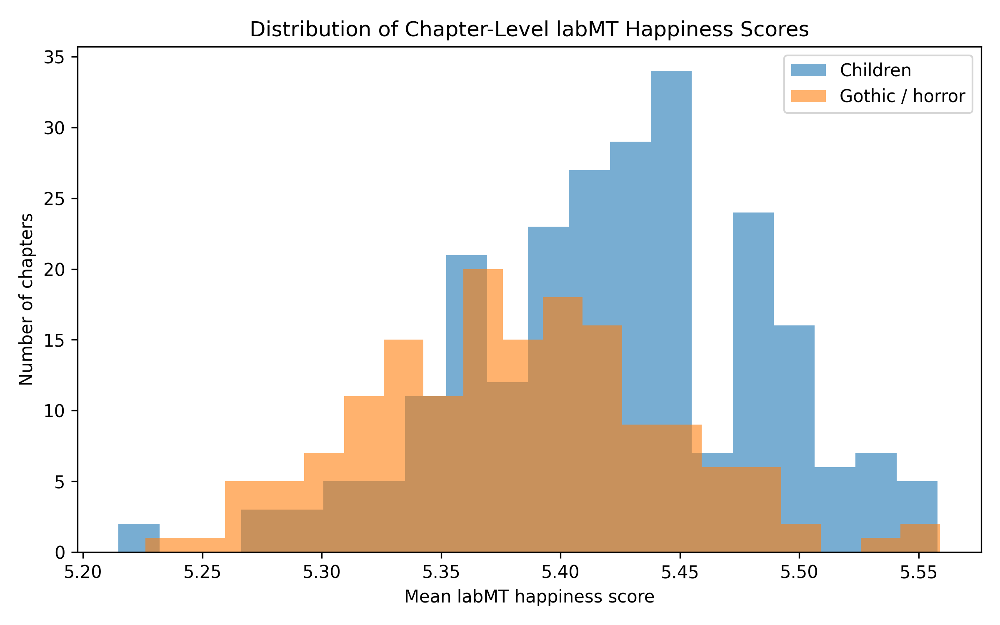
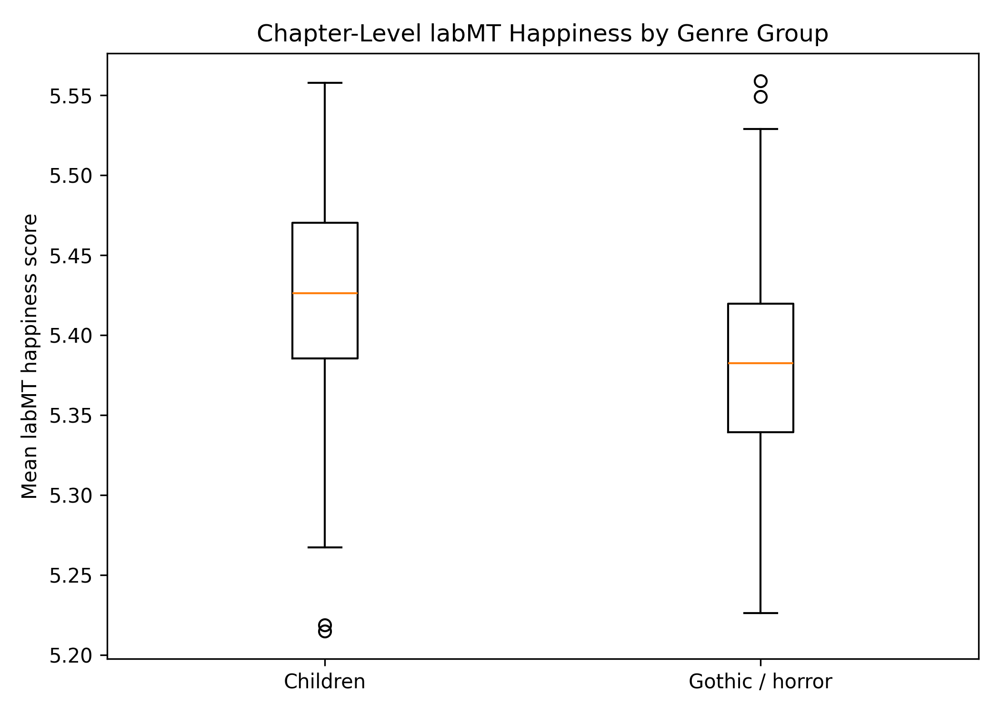
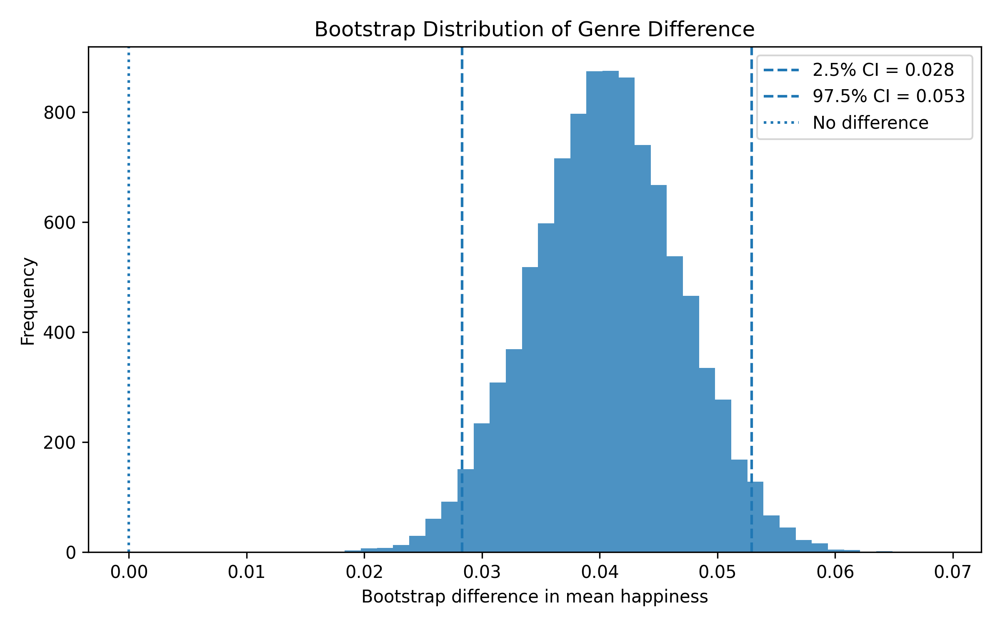
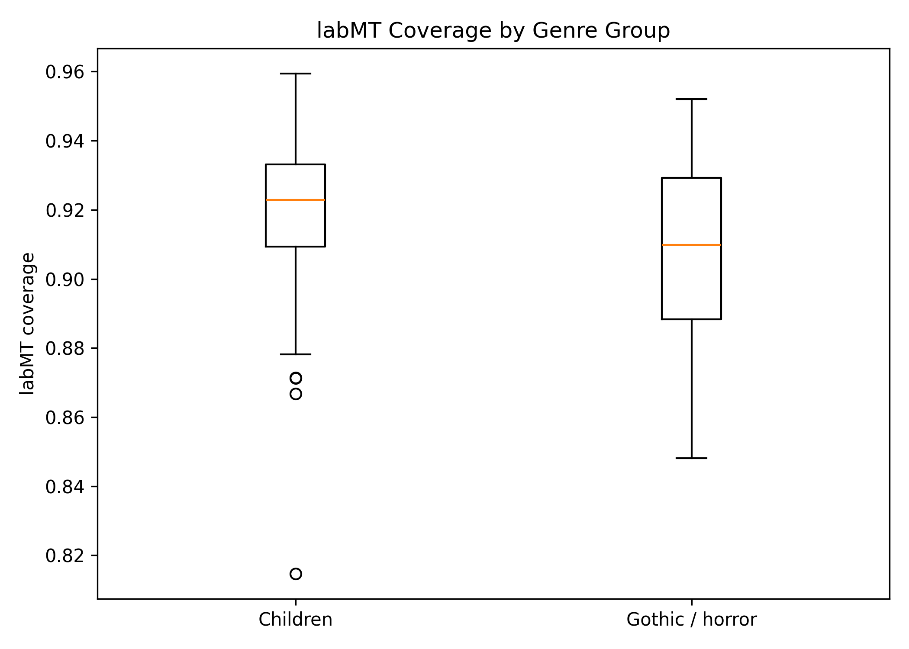

# Measuring Genre Mood: labMT Happiness in Project Gutenberg Fiction

## Overview

This project uses the labMT (language assessment by Mechanical Turk) word-happiness lexicon to measure and compare emotional valence across chapters of public-domain fiction from Project Gutenberg. The corpus is divided into two genre groups — children's literature and gothic/horror fiction — to test whether genre is associated with a systematic difference in lexical happiness scores.

The pipeline runs end-to-end from raw `.txt` downloads to summary tables and figures in four numbered scripts. All preprocessing decisions are recorded in `data/raw/metadata.csv` so that the analysis is transparent and reproducible.

The project matters for Digital Humanities and Cultural Analytics, because it treats literary genre not only as an interpretive category, but also as a measurable textual grouping whose patterns and limits can be tested through computational methods.

## Research Question

Do chapters from children's literature score higher on the labMT happiness scale than chapters from gothic/horror fiction, and is that difference consistent across analysis choices (chapter-level scoring, stricter quality thresholds, and book-level aggregation)?

## Corpus

The repair assignemtn uses a different corpus from the original group project. The first group project attempt used IMDb film reviews as the text corpus. This individual repair project uses public-domain literary fiction from Project Gutenberg. The unit of analysis also changes from user-written reviews to chapters from published books, and the main metadata variable changes from review-related metadata to manually documented literary genre group. 

Therefore this corpus was drawn from Project Gutenberg and divided into two balanced genre groups.

| Genre | Books | Chapters (retained) | Mean words / chapter |
|---|---|---|---|
| Children's literature | 10 | 240 | 3,161 |
| Gothic / horror fiction | 9 | 160 | 3,705 |

**Books in the corpus** (from `data/raw/metadata.csv`):

*Children's literature:* Alice's Adventures in Wonderland (Carroll), Anne of Green Gables (Montgomery), Black Beauty (Sewell), Five Children and It (Nesbit), Heidi (Spyri), Little Women (Alcott), Peter Pan (Barrie), The Secret Garden (Burnett), The Wind in the Willows (Grahame), The Wonderful Wizard of Oz (Baum).

*Gothic / horror fiction:* Carmilla (Le Fanu), Dracula (Stoker), Frankenstein (Shelley), Strange Case of Dr Jekyll and Mr Hyde (Stevenson), The Castle of Otranto (Walpole), The House of the Seven Gables (Hawthorne), The King in Yellow (Chambers), The Picture of Dorian Gray (Wilde), The Turn of the Screw (James).

**From 20 to 19 books.** The initial metadata contained 20 books (10 children, 10 gothic/horror). After chapter segmentation and quality filtering, 19 books were retained for the main analysis. One text — *Vathek* (Beckford) — was excluded because its segmentation produced no chapters that met the minimum token threshold (≥ 300 tokens, ≥ 100 labMT-matched tokens), making it impossible to compute a reliable chapter-level score.

**Chapter segmentation.** Project Gutenberg books have inconsistent chapter heading conventions. Most books used the `default` splitting pattern, which matches headings such as `CHAPTER I`, `CHAPTER 1`, `CHAPTER ONE`, or `I. Title`. Two texts required custom patterns:

- *Strange Case of Dr Jekyll and Mr Hyde* used `allcaps_title`: the text has no "CHAPTER" headings; instead each section begins with an all-capital title line (e.g., `STORY OF THE DOOR`).
- *The Turn of the Screw* used `roman_only`: sections are headed by a standalone Roman numeral on its own line (e.g., `I`, `II`, `III`).

The `chapter_pattern` column in `data/raw/metadata.csv` records which pattern was applied to each book, making this preprocessing decision transparent and reproducible.

### Difference from the original group project

This repair assignment uses a different corpus from the original group project. The earlier group project used IMDb film reviews, while this project uses public-domain fiction from Project Gutenberg. This changes both the source and the unit of analysis: instead of comparing user-written film reviews, this project compares chapters from literary works. The main metadata variable is also different. Here, the comparison depends on manually documented literary genre group, recorded in `data/raw/metadata.csv`.

## Method

The pipeline consists of four scripts run in order from the repository root.

**Step 1 — Build corpus** (`src/01_build_corpus.py`). Reads each raw text file, strips Project Gutenberg header and footer boilerplate using standard `*** START / END ***` markers, splits the cleaned text into chapters using the pattern recorded in `metadata.csv`, and writes one row per chapter to `data/processed/chapters.csv`.

**Step 2 — Score with labMT** (`src/02_score_labmt.py`). Tokenises each chapter into lowercase alphabetic tokens and looks each token up in the labMT lexicon (`data/raw/labmt/labMT.csv`). Per chapter it records: total token count, matched token count, out-of-vocabulary token count, lexicon coverage (matched / total), mean happiness score, and median happiness score. Output is `data/processed/scored_chapters.csv`.

**Step 3 — Analyse results** (`src/03_analyse_results.py`). Applies quality filters (≥ 300 tokens, ≥ 100 matched tokens), then:
- Computes genre-level and book-level summary statistics.
- Runs a 10,000-iteration percentile bootstrap to estimate a 95 % confidence interval for the difference in mean happiness (children minus gothic/horror). Random seed is fixed at 42 for reproducibility.
- Runs two robustness checks (stricter matched-token threshold; book-level aggregation).
- Produces a qualitative word exhibit showing the most frequent high-scoring, low-scoring, and mid-range words by genre.
- Saves four figures and four tables.

**Chapter-level vs. book-level scoring.** Chapter-level scores are the primary unit of analysis because they capture within-book variation and provide a larger effective sample. However, chapters are nested within books, so book-level aggregation is used as a robustness check. The project reports both, and conclusions are drawn only where the two levels agree in direction.

The labMT lexicon covers approximately 10,000 common English words with crowd-sourced happiness ratings on a 1–9 scale (neutral ≈ 5). No stopword removal was applied; all matched words contribute to the score, which is the standard labMT protocol.

## Results

**Genre-level summary** (from `tables/genre_summary.csv`):

| Genre | Chapters | Mean happiness | Median happiness | SD | Mean coverage |
|---|---|---|---|---|---|
| Children's literature | 240 | 5.422 | 5.426 | 0.062 | 92.1 % |
| Gothic / horror fiction | 160 | 5.382 | 5.383 | 0.061 | 90.8 % |

The observed difference is **0.041** happiness points (children minus gothic/horror). A 10,000-iteration percentile bootstrap yields a 95 % confidence interval of **[0.028, 0.053]** at the chapter level, which does not include zero (Figure 3).

**Figure 1** shows the distribution of chapter-level scores for both genres. The children's distribution is shifted slightly to the right; both distributions span roughly 5.20–5.56 and have considerable overlap.



**Figure 2** shows the same data as side-by-side boxplots. The median for children's literature (≈ 5.43) sits above the median for gothic/horror (≈ 5.38). The interquartile ranges overlap substantially, and each genre has outlier chapters in the other genre's range.



**Figure 3** shows the bootstrap distribution of the mean difference. All 10,000 bootstrap resamples produced a positive difference; the distribution is well separated from zero.



**Figure 4** shows labMT lexicon coverage by genre. Children's chapters have slightly higher median coverage (≈ 92 %) than gothic/horror chapters (≈ 91 %), consistent with children's texts using more common vocabulary. Coverage differences do not appear large enough to account for the observed genre gap on their own. However, coverage cannot be treated as neutral either. If gothic/horror texts contain more ancient, rare, or genre-specific OOV vocabulary, some emotionally important words may be missing from the labMT calculation. For this reason, Figure 4 is used as a validation check rather than as proof that coverage has no effect. If anything, higher gothic/horror coverage of rare or negative words would push its scores down, not up.



**Book-level summary** (full contents of `tables/book_summary.csv`, sorted by mean happiness within each genre):

| Title | Genre | Chapters | Mean happiness | Median | Mean coverage | Mean words / chapter |
|---|---|---|---|---|---|---|
| Little Women | children | 47 | 5.464 | 5.470 | 0.917 | 4,064 |
| Anne of Green Gables | children | 38 | 5.445 | 5.436 | 0.911 | 2,812 |
| The Wind in the Willows | children | 39 | 5.439 | 5.451 | 0.913 | 1,398 |
| Heidi | children | 23 | 5.433 | 5.435 | 0.925 | 4,015 |
| The Wonderful Wizard of Oz | children | 23 | 5.400 | 5.404 | 0.934 | 1,719 |
| The Secret Garden | children | 27 | 5.396 | 5.407 | 0.932 | 3,085 |
| Black Beauty | children | 2 | 5.388 | 5.388 | 0.948 | 30,390 |
| Five Children and It | children | 12 | 5.383 | 5.386 | 0.920 | 4,590 |
| Alice's Adventures in Wonderland | children | 12 | 5.370 | 5.363 | 0.932 | 2,278 |
| Peter Pan | children | 17 | 5.346 | 5.386 | 0.920 | 2,817 |
| Frankenstein | gothic_horror | 27 | 5.418 | 5.417 | 0.894 | 2,780 |
| Carmilla | gothic_horror | 17 | 5.416 | 5.430 | 0.911 | 1,650 |
| The Picture of Dorian Gray | gothic_horror | 22 | 5.384 | 5.410 | 0.913 | 3,656 |
| Dracula | gothic_horror | 29 | 5.378 | 5.377 | 0.928 | 5,624 |
| The Turn of the Screw | gothic_horror | 25 | 5.372 | 5.381 | 0.934 | 1,736 |
| The House of the Seven Gables | gothic_horror | 23 | 5.363 | 5.365 | 0.878 | 4,700 |
| The Castle of Otranto | gothic_horror | 5 | 5.360 | 5.355 | 0.865 | 7,026 |
| The King in Yellow | gothic_horror | 2 | 5.332 | 5.332 | 0.863 | 16,820 |
| Strange Case of Dr Jekyll and Mr Hyde | gothic_horror | 10 | 5.323 | 5.312 | 0.910 | 2,591 |

Children's titles range from 5.346 (Peter Pan) to 5.464 (Little Women); gothic/horror titles range from 5.323 (Jekyll & Hyde) to 5.418 (Frankenstein). The two ranges overlap heavily: the happiest gothic/horror books (Frankenstein 5.418, Carmilla 5.416) score above six of the ten children's books, which shows directly that genre is a weak predictor at the book level. The table also exposes uneven segmentation — most books split into 10–47 chapters, but Black Beauty (2 chapters), The King in Yellow (2), and The Castle of Otranto (5) produced very few, very long blocks (mean word counts up to 30,390). Their chapter splitter found few standard headings, so these three book-level means rest on only a handful of data points and should be read with extra caution.

**Qualitative word exhibit** (from `tables/word_exhibit.csv`): The most frequent high-scoring words (labMT ≥ 7.0) in children's texts are *like* (7.22, n = 2,078), *good* (7.20, n = 1,607), *mother* (7.68, n = 822), *great* (7.88, n = 806), and *home* (7.14, n = 800). In gothic/horror: *like* (7.22, n = 973), *life* (7.32, n = 784), *good* (7.20, n = 713), *great* (7.88, n = 613), *heart* (7.22, n = 462). The word *mother* is prominent in children's texts but absent from the gothic/horror top five; *death* (1.54, n = 345) appears as the fifth most frequent low-scoring word in gothic/horror but not in children's texts.

## Robustness Checks

Three checks are reported in `tables/robustness_summary.csv`:

| Check | n (children) | n (gothic) | Observed diff | 95 % CI |
|---|---|---|---|---|
| Main (chapter-level) | 240 | 160 | 0.041 | [0.028, 0.053] |
| Stricter matched-token threshold (≥ 200) | 240 | 160 | 0.041 | [0.028, 0.053] |
| Book-level aggregation | 10 | 9 | 0.035 | [0.005, 0.064] |

Book-level aggregation reduces the sample to 10 children's books and 9 gothic/horror books and produces a smaller observed difference (0.035). The 95 % CI at the book level is [0.005, 0.064]. The lower bound is close to zero, reflecting the small number of books. The direction is consistent with the chapter-level finding, but the book-level interval is wide.

### Why the stricter matched-token threshold changes nothing

The stricter check raises the minimum number of labMT-matched tokens per chapter from 100 to 200. It returns exactly the same 240 and 160 chapters as the main analysis, and therefore an identical confidence interval. This is not because the check was skipped — it is a logical consequence of the other two filters.

The main analysis already requires each chapter to have at least 300 total tokens, and labMT coverage in this corpus is high (about 86–96 % of tokens are matched; see Figure 4). A chapter with 300 total tokens, even at the lowest observed coverage, already produces well over 200 matched tokens. Inspecting `data/processed/scored_chapters.csv` confirms this: among the 400 retained chapters the **smallest matched-token count is 312**, and **no chapter falls in the 100–199 band** that the stricter threshold targets. Raising the floor from 100 to 200 therefore excludes nothing, and the result is identical by construction rather than by coincidence.

The check is still worth reporting: it confirms that the genre difference does not depend on a small number of marginally-scored, low-coverage chapters. If such chapters existed, the stricter threshold would have removed them and the interval would have shifted.

### Validation: lexicon coverage does not explain the genre difference

A natural objection is that the genre gap could be an artefact of the labMT lexicon rather than a real difference in mood: if one genre simply has more of its words inside the lexicon, its mean might be pulled toward the lexicon average for purely mechanical reasons. Figure 4 is used to rule this out.

Children's chapters have slightly higher labMT coverage (median ≈ 92 %) than gothic/horror chapters (median ≈ 91 %). Crucially, the *direction* of this small coverage gap works against a mechanical explanation. The words that gothic/horror texts use but the lexicon misses are disproportionately rare, archaic, or strongly negative vocabulary; if those words were matched, they would push the gothic/horror mean *down*, not up. The coverage difference therefore cannot manufacture a higher score for children's literature — if anything it makes the observed genre difference slightly conservative.

Combined with the threshold check above (every retained chapter is scored on at least 312 matched tokens, so individual chapter means are stable and not dominated by a handful of words), Figure 4 confirms that the 0.041-point difference reflects the happiness values of the matched words themselves, not how many words happened to be matched.

### Sensitivity to other analytical choices

Two further choices were fixed rather than swept over a range. Their likely influence is noted here for transparency.

- **Minimum chapter length (100 words).** During segmentation, any block shorter than 100 words is discarded as a heading fragment or front-matter rather than treated as a real chapter. Raising this cutoff would drop a few short chapters (which are noisier because they rest on fewer tokens); lowering it would admit table-of-contents lines and dedications. Because the downstream analysis applies a much stricter 300-token filter anyway, the 100-word segmentation cutoff has little effect on the final retained set.
- **labMT neutral point (≈ 5 on the 1–9 scale).** Every chapter mean in this corpus falls in a narrow band of roughly 5.3–5.5, slightly above the lexicon's neutral midpoint of 5. This is expected: frequent function words such as *the* (4.98) and *and* (5.22) sit near 5 and compress every document toward the centre of the scale. The genre comparison in this project is therefore **relative, not absolute** — it asks which genre scores higher, not whether either genre is "happy" in any absolute sense. Reading the raw values as absolute mood would misuse the scale.

These two parameters were not varied systematically the way corpus size and the token thresholds were. A fuller sensitivity analysis would re-run the pipeline across a grid of segmentation and threshold values; that is left as a possible extension.

## Interpretation

Children's literature shows a slightly higher average labMT happiness score in this corpus (mean difference = 0.041 points on a 1–9 scale), and confidence interval is positive at both levels, but the book-level lower bound is very close to zero, so the book-level result should be read as weak directional support rather than strong confirmation. However, the result should be interpreted cautiously:

- The book-level sample is small (10 vs. 9 books). Individual books have an outsized influence on the group mean, and the book-level CI lower bound (0.005) is very close to zero.
- The two distributions overlap substantially (Figures 1 and 2). Genre is a weak predictor: some gothic/horror books score higher than some children's books.
- The labMT score is a bag-of-words average. It does not capture irony, negation, narrative context, or sentence structure. A word like *cried* (2.20) scores the same whether it describes grief or laughter.
- The absolute difference (0.041 points) is small relative to the scale range and the within-genre standard deviation (≈ 0.062).

The result is consistent with the hypothesis that genre is associated with lexical emotional valence, but the corpus is too small and the method too coarse to support a strong causal or interpretive claim.

## Limitations

- **Small book-level N.** With 10 and 9 books per group, adding or removing a single title can shift the group mean meaningfully. The chapter-level bootstrap treats chapters as independent, which underestimates uncertainty from the nested (chapter-within-book) structure.
- **Lexicon coverage, not content.** The labMT method scores only words present in the lexicon. Out-of-vocabulary words (archaic vocabulary, proper nouns, invented words) are ignored regardless of their emotional weight.
- **No stopword removal.** High-frequency neutral function words (e.g., *the* ≈ 4.98, *and* ≈ 5.22) are included in the score and pull all chapters toward the lexicon mean, compressing genre differences.
- **Binary genre labels.** "Children's literature" and "gothic/horror fiction" are broad and heterogeneous categories. Some books fit multiple genres (e.g., Dorian Gray has aestheticist as well as gothic elements).
- **Public-domain bias.** All texts were published before 1928. The sample is not representative of either genre across time.

## Repository Structure

```
labmt-gutenberg-genre-mood/
├── data/
│   ├── raw/
│   │   ├── children/          # Raw .txt files — children's literature
│   │   ├── gothic_horror/     # Raw .txt files — gothic/horror fiction
│   │   ├── labmt/
│   │   │   ├── labMT.csv      # labMT lexicon (place here manually)
│   │   │   └── README.md      # Instructions for obtaining labMT.csv
│   │   └── metadata.csv       # One row per book; includes chapter_pattern column
│   └── processed/
│       ├── chapters.csv       # One row per chapter (output of script 01)
│       └── scored_chapters.csv # chapters.csv + labMT scores (output of script 02)
├── figures/
│   ├── figure1_distribution.png
│   ├── figure2_genre_boxplot.png
│   ├── figure3_bootstrap_difference.png
│   └── figure4_coverage_by_genre.png
├── src/
│   ├── 00_download_sources.py  # Optional: download raw texts automatically
│   ├── 01_build_corpus.py      # Segment texts into chapters
│   ├── 02_score_labmt.py       # Score each chapter with labMT
│   ├── 03_analyse_results.py   # Generate tables, figures, robustness checks
│   └── utils.py                # Shared helpers (tokeniser, splitter, boilerplate stripper)
├── tables/
│   ├── book_summary.csv        # Per-book means and chapter counts
│   ├── genre_summary.csv       # Per-genre aggregate statistics
│   ├── robustness_summary.csv  # Three robustness checks with bootstrap CIs
│   └── word_exhibit.csv        # Frequent high/low/mid-scoring words by genre
├── requirements.txt
└── README.md
```

## How to Reproduce

**Requirements:** Python 3.9+ with `pandas`, `numpy`, `matplotlib`, and `requests` (see `requirements.txt`).

```bash
pip install -r requirements.txt
```

**Step 0 — Obtain raw texts** (if not already present):

```bash
python src/00_download_sources.py
```

Alternatively, place the raw `.txt` files manually in `data/raw/children/` and `data/raw/gothic_horror/` following the filenames in `data/raw/metadata.csv`.

**Step 0b — Obtain the labMT lexicon.** Place the labMT word-score file at `data/raw/labmt/labMT.csv`. The file should contain at minimum a word column and a `happiness_average` column. See `data/raw/labmt/README.md` for details.

**Step 1 — Build the chapter corpus:**

```bash
python src/01_build_corpus.py
```

Output: `data/processed/chapters.csv`. The script prints the chapter count for each book and the splitting pattern used. Verify that the counts match `tables/book_summary.csv`.

**Step 2 — Score with labMT:**

```bash
python src/02_score_labmt.py
```

Output: `data/processed/scored_chapters.csv`. The script prints coverage and happiness summaries by genre.

**Step 3 — Run analysis:**

```bash
python src/03_analyse_results.py
```

Output: all four tables in `tables/` and all four figures in `figures/`. The random seed is fixed at 42; bootstrap results are deterministic.


## Reflection

When I started this project I assumed that measuring "mood" in fiction would be mostly a technical problem. It means loading the texts, applying the labMT lexicon, and reading off which genre is happier. The actual work turned out to be far more about data decisions than about the scoring step itself.

The first version of the corpus had only five books per genre. When I ran the analysis, the difference between children's and gothic/horror fiction was very small and the bootstrap confidence interval almost touched zero. This was an important moment, because it forced me to ask whether the result was real or just an artefact of a tiny sample. Expanding the corpus to ten books per genre made the difference more stable — but it also taught me that the same method can look convincing or unconvincing depending only on how much data was collected.

The second lesson came from errors I did not expect. Two books, *The Picture of Dorian Gray* and *The Secret Garden*, had their genre labels swapped in the metadata. Because the whole analysis is grouped by genre, that single mistake would have quietly biased every table and figure. I only caught it by reading the book-level output and noticing a title that did not behave like the rest of its group. After that I stopped trusting any number until I had traced it back to the raw data.

Chapter segmentation was the hardest part. *Strange Case of Dr Jekyll and Mr Hyde* and *The Turn of the Screw* do not use standard "CHAPTER I" headings, so the splitter silently treated each book as a single block and they fell out of the chapter-level analysis. The gothic/horror chapter count dropped before I noticed the gap. Fixing this with a `chapter_pattern` column in the metadata, instead of hard-coding exceptions inside the script, is the change I am most satisfied with: it makes a preprocessing decision visible and auditable rather than hidden in code.

Working with labMT also made me cautious about what the score actually means. It is a bag-of-words average, so it cannot tell "cried" out of grief from "cried" out of joy, and it ignores negation completely. The genre difference I found — about 0.04 points on a 1–9 scale — is real in the statistical sense but small, and the two distributions overlap heavily. I now read it as a weak tendency rather than a clear separation between genres.

If I did this again, I would build the segmentation and label checks first, before any scoring, because most of my time went into discovering and repairing problems that earlier validation would have caught. The main thing I learned is that in text analysis the lexicon is the easy part; the corpus decisions are where the real interpretation happens.

## GenAI Disclosure Section


**Tools used:**
I used GenAI tools during this assignment, mainly Claude through claude.ai and ChatGPT through chat.openai.com. The tools were used for project planning, code drafting, debugging support, README wording, and clarification of technical problems in the workflow.

GenAI support was especially useful in three parts of the project. First, it helped me draft and debug Python scripts for cleaning Project Gutenberg texts, splitting books into chapters, matching tokens with the labMT lexicon, calculating chapter-level happiness scores, running bootstrap confidence intervals, and generating figures. Second, it helped me diagnose data and preprocessing problems, including reversed genre labels for *The Picture of Dorian Gray* and *The Secret Garden*, and failed chapter splitting for *Strange Case of Dr Jekyll and Mr Hyde* and *The Turn of the Screw*. Third, it helped me improve the structure and wording of the README.

I did not use GenAI outputs without checking them. I verified the final project by rerunning the scripts, checking that the CSV tables and figures were regenerated, comparing all numerical claims in the README with the generated outputs, inspecting the book-level and genre-level summaries, and revising claims that were not supported by the data. The research question, corpus selection, metadata corrections, interpretation, and final submission decisions are my responsibility.

**Could this assignment be completed without GenAI?**
The project could be completed without GenAI because the workflow uses standard Python scripts, CSV files, Project Gutenberg texts, and the labMT lexicon. GenAI made the process faster and helped with debugging, but the final results were retained only after manual inspection and verification.


